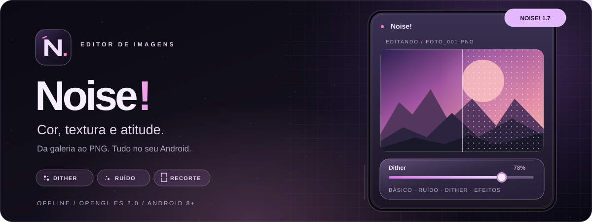
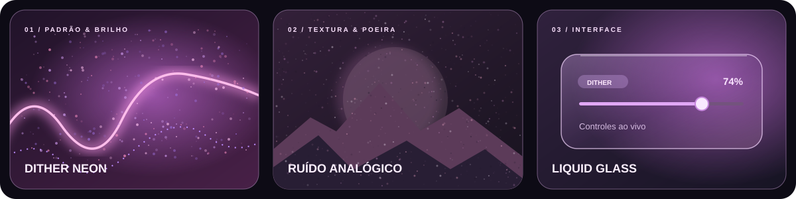

<div align="center">
  

  **Editor de imagens offline para Android.** Efeitos criativos, ajustes em tempo real e exportação em PNG.

  [**Baixar APK**](https://github.com/DiscNet/Noise/releases/latest) · [Explorar código](app/src/main) · [Compilar](#compilação)
</div>

<br>

<div align="center">
  
  <sub>Arte ilustrativa dos efeitos e da identidade visual do app.</sub>
</div>

## Recursos

- ◈ **Cor & luz:** saturação, vibração, exposição, contraste, matiz e outros ajustes com prévia pela GPU.
- ⁙ **Texturas & efeitos:** ruído, dither neon, brilho difuso, desvio RGB, poeira, vinheta, desfoque e inversão de cores.
- ⌗ **Recorte livre:** ajuste a seleção arrastando os cantos da imagem.
- ▧ **Galeria integrada:** fotos recentes e acesso a todas as imagens do álbum selecionado.
- ↓ **Salvamento direto:** PNG em `Imagens/Noise!` (`Pictures/Noise!`), preservado após desinstalar o app.

## Download

**[→ Última versão do Noise!](https://github.com/DiscNet/Noise/releases/latest)**  
Android 8.0+ · Sem conta · Edição offline

## Compilação

Requer **Java 17**, **Gradle 8.9** e **Android SDK 35**.

```bash
gradle --no-daemon assembleDebug
```

APK gerado em `app/build/outputs/apk/debug/app-debug.apk`.

<sub>Noise! v1.7 · DiscNet · OpenGL ES 2.0</sub>
